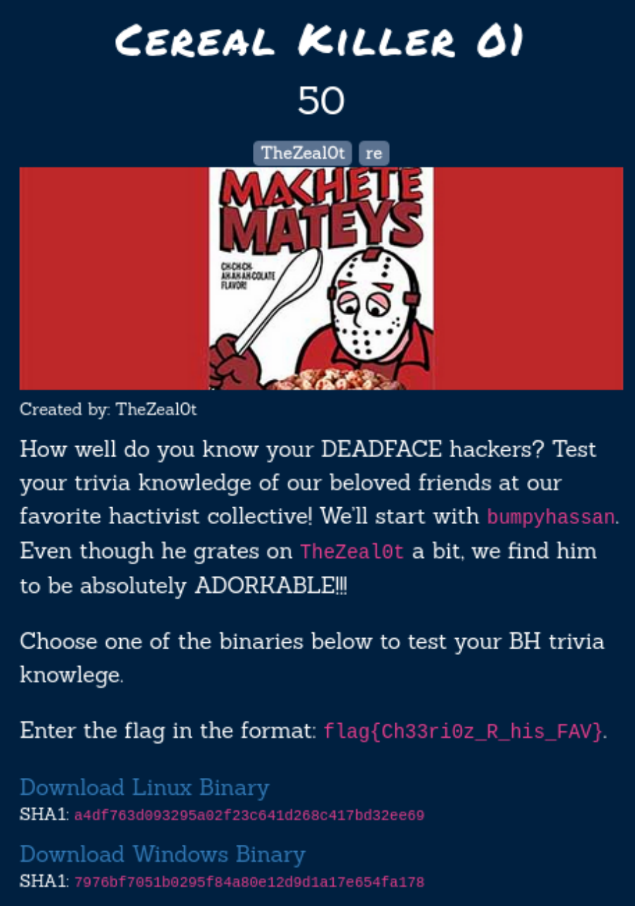
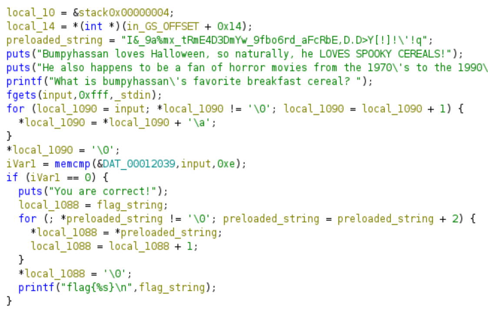
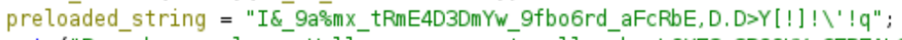
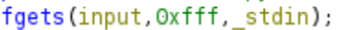
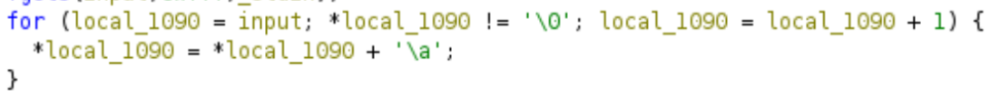
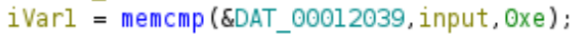
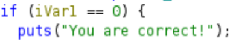
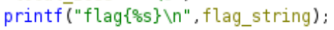
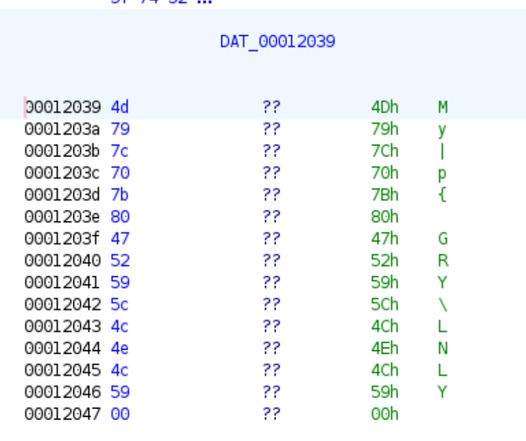

# The challenge



I downloaded the Linux binary file, analyzed it in ghidra and finally wrote a python script to get the password for the binary.

# The file
```bash
└─$ file re01                  
re01: ELF 32-bit LSB pie executable, Intel 80386, version 1 (SYSV), dynamically linked, interpreter /lib/ld-linux.so.2, BuildID[sha1]=e558289cacf3632bd79bb7eec1adaad41554b5e3, for GNU/Linux 3.2.0, not stripped
```

When executed, the binary is asking for bumpyhassan's favorite breakfast cereal. So our goal is to find the right one.
```bash
└─$ ./re01
Bumpyhassan loves Halloween, so naturally, he LOVES SPOOKY CEREALS!
He also happens to be a fan of horror movies from the 1970's to the 1990's.
What is bumpyhassan's favorite breakfast cereal? halloween cereals
Sorry, that is not bumpyhassan's favorite cereal. :(
```

# Analyzing in ghidra

To gain further insight into the provided binary, I decided to reverse engineer it in ghidra.

I decided to look at the main function to see if I could find the right cereals. I renamed some of the variables to make it a bit easier to understand what is happening.



The first thing that looks interesting is the String in the variable "preloaded_string". The String will be manipulated and turn into the content of the flag later.



After the text of the binary is printed to the screen, the user input is read into the binary with the fgets() function. Since this is a secure function, no buffer overflow is possible.



Next, there is a for loop that will go through every character of our input String and add '\\a' (which is 7 in decimal).



After this, the first 0xe (or 14 in decimal) characters of the resulting String are compared to some hardcoded data.



If the Strings are the same, we will get the message "You are correct" and it will print the flag.






# The idea

My idea is to get the data that's used for the comparison and manipulate it in a way that will give us the favorite cereals.

In ghidra, we are able to see the data and copy it in a format of our liking by right-clicking and selecting "Copy Special". I copied the first 14 characters as a python byte array.



Since the for-loop in the binary adds 7 to each character, my python script will subtract 7, which should result in the favorite cereals.

This way, when we enter the favorite cereals into the program and 7 is added again by the binary, the Strings will be the same and it will print the flag!

# The python script

```python
data = b'\x4d\x79\x7c\x70\x7b\x80\x47\x52\x59\x5c\x4c\x4e\x4c\x59'

for c in data:
    print(chr(c-7), end ="")
```

In this script, I put the first 14 bytes of the copied byte array into the variable "data".
Then, I subtracted 7 from each value and printed the result as a single line.

This script printed the result "Fruity@KRUEGER", which seems to be the favorite cereal and therefore our password.
# The flag

```bash
└─$ ./re01
Bumpyhassan loves Halloween, so naturally, he LOVES SPOOKY CEREALS!
He also happens to be a fan of horror movies from the 1970's to the 1990's.
What is bumpyhassan's favorite breakfast cereal? Fruity@KRUEGER
You are correct!
flag{I_am_REDDY_for_FREDDY!!!}
```

