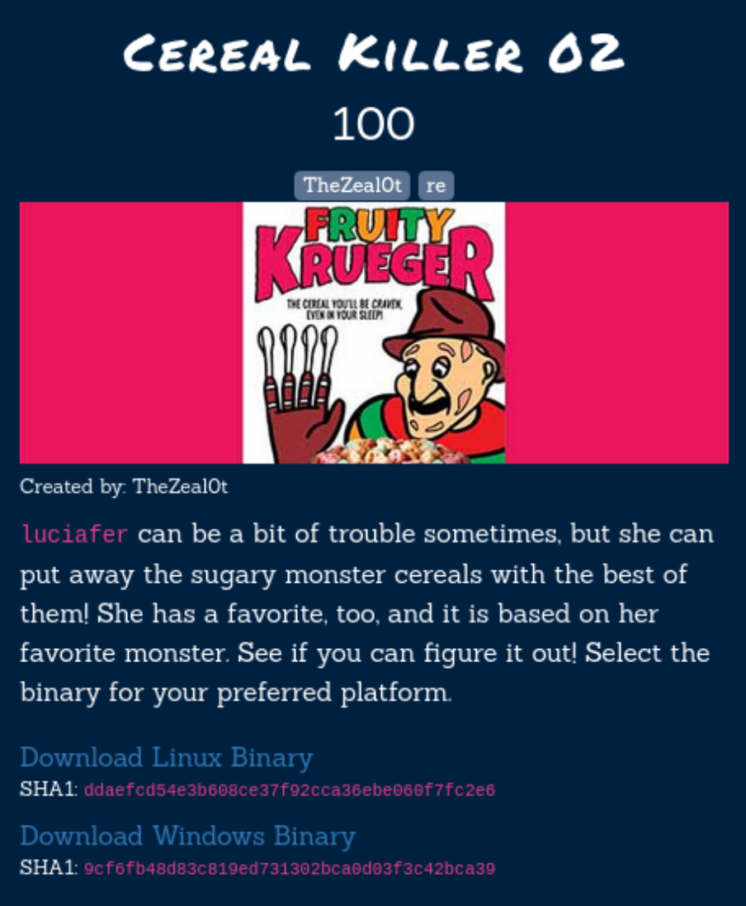

I downloaded the Linux binary file, analyzed it in ghidra and finally wrote a python script to get the password for the binary.

# The file

```bash
└─$ file re02.bin 
re02.bin: ELF 32-bit LSB pie executable, Intel 80386, version 1 (SYSV), dynamically linked, interpreter /lib/ld-linux.so.2, BuildID[sha1]=04cf7e5f6cf62bcd906c4ba92c924ec4d56422a3, for GNU/Linux 4.4.0, not stripped
```

When executed, the binary asks for Luciafer's favorite breakfast cereal. So it's our goal to find the right input to get the flag.

```bash
└─$ ./re02.bin 
Luciafer also loves Halloween, so she, too, LOVES SPOOKY CEREALS!
She has different favorite villain from 70-80's horror movies.
What is Luciafer's favorite breakfast cereal? halloween cereal
INCORRECT....: I'm afraid that is not Lucia's current favorite monster cereal.  She is kind of capricious, you know, so it changes often.
```


# Analyzing in ghidra

In ghidra, I started looking at the decompiled main function to understand what is happening in the binary file.

### main function

```c
undefined4 main(void)

{
  int iVar1;
  undefined4 uVar2;
  int in_GS_OFFSET;
  char input [4096];
  char charArray4096 [4096];
  int local_14;
  undefined *local_10;
  
  local_10 = &stack0x00000004;
  local_14 = *(int *)(in_GS_OFFSET + 0x14);
  puts("Luciafer also loves Halloween, so she, too, LOVES SPOOKY CEREALS!");
  puts("She has different favorite villain from 70-80\'s horror movies.");
  printf("What is Luciafer\'s favorite breakfast cereal? ");
  fgets(input,0xfff,_stdin);
  decode_str(input,0x3f,&DAT_00012094,charArray4096);
  iVar1 = strncmp(charArray4096,"CORRECT!!!!!",0xc);
  if (iVar1 == 0) {
    puts(charArray4096);
  }
  else {
    printf("%s",
           "INCORRECT....: I\'m afraid that is not Lucia\'s current favorite monster cereal.  She is  kind of capricious, you know, so it changes often.\n"
          );
  }
  uVar2 = 0;
  if (local_14 != *(int *)(in_GS_OFFSET + 0x14)) {
    uVar2 = __stack_chk_fail_local();
  }
  return uVar2;
```

After the text is printed, we can see that the input we provide is read into the binary with the fgets() function.
```c
printf("What is Luciafer\'s favorite breakfast cereal? ");
fgets(input,0xfff,_stdin);
```

Then, the input, the value 0x3f (63 in decimal), some hardcoded data and a character buffer are passed as arguments into a function "decode_str".

```c
decode_str(input,0x3f,&DAT_00012094,charArray4096);
```

The first 0xc (so 12 in decimal) characters of the character array are then compared to the String "CORRECT!!!!!".

```c
 iVar1 = strncmp(charArray4096,"CORRECT!!!!!",0xc);
```

If the values are the same, the whole character array is printed. It will probably contain the flag.

```c
if (iVar1 == 0) {
    puts(charArray4096);
  }
```


### decode_str function

I renamed the parameters to understand better what this function does.

```c
void decode_str(int input,int max_set_to_63,int data_from_memory,int result)

{
  int counter_max_11;
  int counter_i;
  
  counter_max_11 = 0;
  counter_i = 0;
  while (counter_i < max_set_to_63) {
    *(byte *)(result + counter_i) =
         *(byte *)(data_from_memory + counter_i) ^ *(byte *)(input + counter_max_11);
    counter_i = counter_i + 1;
    counter_max_11 = counter_max_11 + 1;
    if (0xb < counter_max_11) {
      counter_max_11 = 0;
    }
  }
  *(undefined *)(result + counter_i) = 0;
  return;
}
```

First, both counter variables are initialized with 0.
```c
counter_max_11 = 0;
counter_i = 0;
```

Then, a while loop is used to write into the memory of the variable "result".
Here, it will xor the first 12 characters of our input repeatedly with the hardcoded data and save the resulting characters in "result".

```c
while (counter_i < max_set_to_63) {
    *(byte *)(result + counter_i) =
         *(byte *)(data_from_memory + counter_i) ^ *(byte *)(input + counter_max_11);
    counter_i = counter_i + 1;
    counter_max_11 = counter_max_11 + 1;
    if (0xb < counter_max_11) {
      counter_max_11 = 0;
    }
  }
```

# The idea

It seems that this is an xor challenge. Xor is a reversible function, which means that there is a way to reverse the xor operation and therefore calculate the correct input. 

We already know the hardcoded data that is used and the result we need (the String "CORRECT!!!!!"). What we want to know is what the input needs to be.

So, to calculate the input, we can xor the data and the String "CORRECT!!!!!".

data ^ "CORRECT!!!!!" = input


# Python script

```python
# first 12 characters of "CORRECT!!!!!"
correct = b'\x43\x4f\x52\x52\x45\x43\x54\x21\x21\x21\x21\x21'

# first 12 characters of the data
data = b'\x08\x3d\x33\x3f\x15\x36\x32\x47\x52\x12\x1b\x65'

for i in range(len(correct)):
        print(chr(correct[i] ^ data[i]), end="")
```

The resulting favorite cereals (or password) is: "KramPuffs3:D"

# The flag

```bash
└─$ ./re02.bin
Luciafer also loves Halloween, so she, too, LOVES SPOOKY CEREALS!
She has different favorite villain from 70-80's horror movies.
What is Luciafer's favorite breakfast cereal? KramPuffs3:D
CORRECT!!!!! : flag{GramPa-KRAMpus-Is-Comin-For-Da-Bad-Kids!!!}
```

