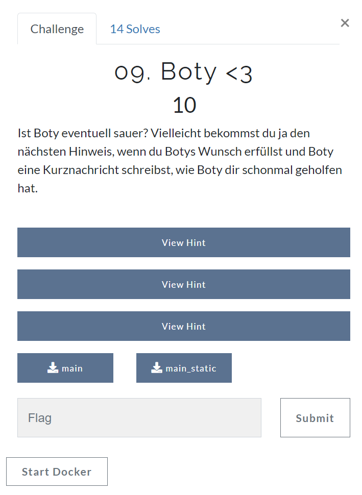
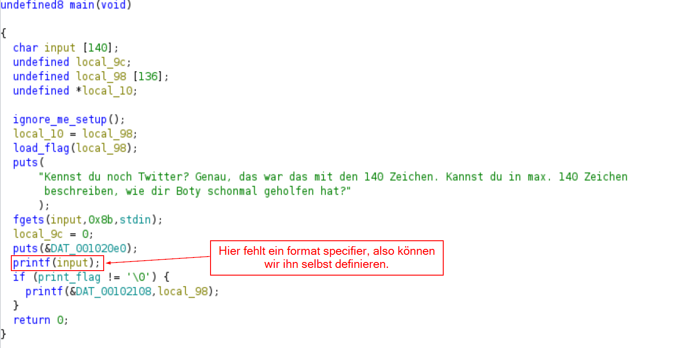

# Tag 09 Boty <3



In dieser Challenge kann die flag durch eine format String vulnerability vom Stack geleakt werden. 

## Was geschieht beim Ausführen des Programms?

Beim Ausführen wird gefragt, wie Boty schon einmal geholfen hat. Anschließend wird das, was wir eingegeben haben, erneut angezeigt:

```bash
└─$ ./main
Kennst du noch Twitter? Genau, das war das mit den 140 Zeichen. Kannst du in max. 140 Zeichen beschreiben, wie dir Boty schonmal geholfen hat?
Er hat mir hilfreiche Links gezeigt <3
Boty hat dir folgendermaßen geholfen:
Er hat mir hilfreiche Links gezeigt <3
```

## Analyse in ghidra



## Wie können wir die flag leaken?

Da bei "printf" kein format specifier angegeben ist, können wir selbst einen format specifier (z.B. %s) eingeben.

## Exkurs: Was geschieht in C, wenn es mehr format specifier als Argumente gibt?

Normalerweise erwartet printf für jeden format specifier ein weiteres Argument. Das sieht beispielsweise so aus:

```C
printf("%s %s %s", "Hello", "beautiful", "world");
```

Wenn weniger Argumente angegeben werden als format specifier, ist das Verhalten undefiniert und hängt vom Compiler ab. Dies sieht dann beispielsweise so aus:

```C
printf("%s %s %s");
```

In den meisten Fällen wird der Compiler nun den nächsten Wert des Stacks versuchen auszugeben, wobei es jedoch auch zu Programmabstürzen kommen kann.

## Was geschieht in dem Programm, wenn wir einen format specifier als input verwenden?

Hier habe ich versucht, die ersten 3 Werte vom Stack zu leaken und erhalte 2 darstellbare Werte zurück:

```shell
└─$ ./main
Kennst du noch Twitter? Genau, das war das mit den 140 Zeichen. Kannst du in max. 140 Zeichen beschreiben, wie dir Boty schonmal geholfen hat?
%s %s %s
Boty hat dir folgendermaßen geholfen:

 (null) H=
```

Dies ist offensichtlich noch nicht unsere Flag. Des Weiteren fällt auf, dass nur 140 Zeichen als Eingabe erlaubt sind. Unter Umständen sind dies zu wenig Zeichen, um an die Speicheradresse zu gelangen, in der die Flag steht.

Um beispielsweise auf den 20. Wert zuzugreifen, ist es möglich, den format specifier als `%20$s` zu schreiben.

Nach einigem Ausprobieren habe ich die flag an der 41. Stelle gefunden.

## die Flag

```shell
Kennst du noch Twitter? Genau, das war das mit den 140 Zeichen. Kannst du in max. 140 Zeichen beschreiben, wie dir Boty schonmal geholfen hat?
%41$s
Boty hat dir folgendermaßen geholfen:
flag{f0rmat_or_n0t_form4t_th4ts_the_questi0n}
```
