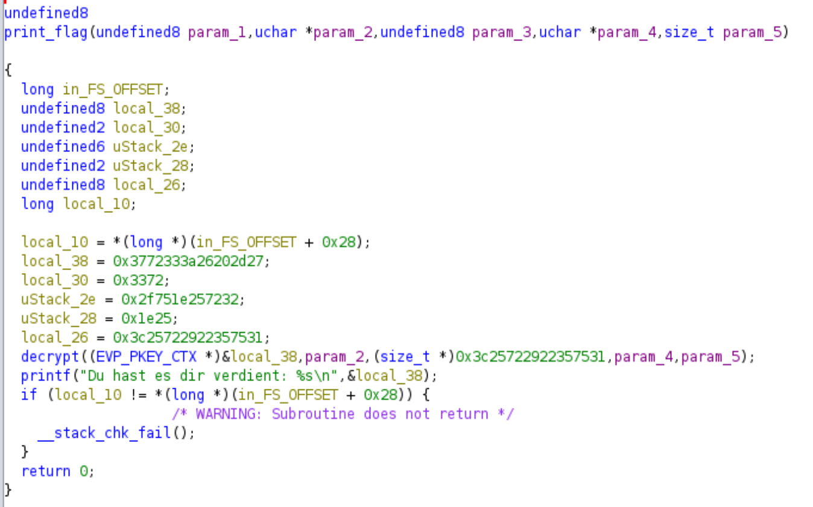
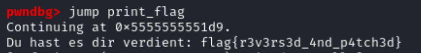

# Tag 16 Geheimniswahrer


In dieser Challenge habe ich einen Debugger genutzt, um eine Funktion print_flag auszuführen, die im regulären Programmablauf nicht ausgeführt wird. Dadurch wurde die flag ausgegeben.

## Die Datei

Ich habe im Folgenden mit der Datei "main" gearbeitet. Hierbei handelt es sich um eine 64-Bit ELF Datei.

```
└─$ file main
main: ELF 64-bit LSB pie executable, x86-64, version 1 (SYSV), dynamically linked, interpreter /lib64/ld-linux-x86-64.so.2, BuildID[sha1]=cd962d9163a077a921ae8553e618a7814820a592, for GNU/Linux 4.4.0, not stripped
```

## Was passiert bei der Ausführung des Programms?

Ich habe versucht, verschiedene Antworten auf die Frage `Möchtest du mein Geheimnis wissen?` zu geben, aber immer war die Antwort `Gib auf, ich verrate dir mein Geheimnis niemals.`

Das korrekte Passwort war also scheinbar noch nicht dabei.

```
└─$ ./main
Möchtest du mein Geheimnis wissen? ja
Gib auf, ich verrate dir mein Geheimnis niemals.
```


## Analyse mit Ghidra

Als nächstes habe ich mir das Programm in Ghidra angeschaut. Dabei ist mir aufgefallen, dass die Berechnungen sehr komplex sind und es nicht einfach ist, den Code zu knacken.

Hier ein Beispiel:



Beim Durchschauen der Funktionsnamen ist mir die Funktion "print_flag" ins Auge gefallen. Falls ich diese Funktion aufrufen kann, gibt sie vielleicht direkt die flag aus?

## Dynamische Analyse mit pwndbg

Als Nächstes habe ich also beschlossen, das Programm dynamisch zu analysieren. Dazu habe ich pwndbg verwendet.

Mein Plan war es, die Ausführung des Programms am Anfang der main-Funktion zu stoppen, an den Anfang der print_flag-Funktion zu springen und anschließend das Programm weiter laufen zu lassen.

Mit `break main` setze ich einen Breakpoint zu Beginn der main-Funktion.

Mit `run` lasse ich das Programm nun bis zum Breakpoint laufen.

Mit `jump print_flag` springe ich nun zum Anfang der Funktion print_flag.

Das Programm wird nun weiter ausgeführt und gibt die Flag aus:



Die flag ist also `flag{r3v3rs3d_4nd_p4tch3d}`.


