# Tag 18 Wunschzettel (Beta)

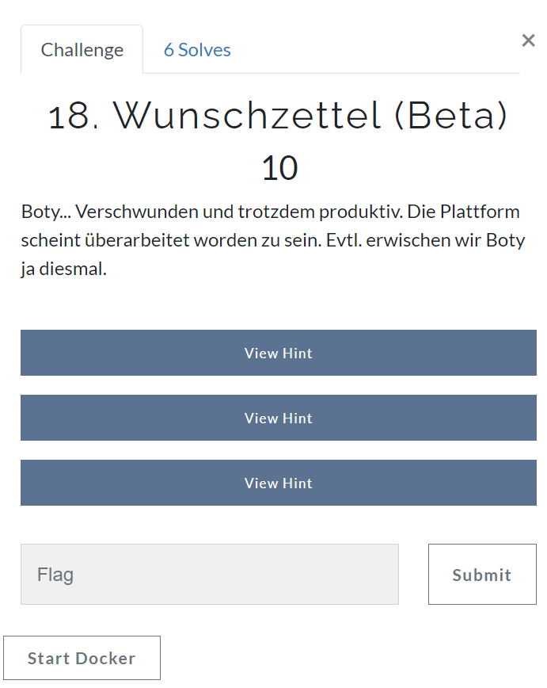

In dieser Challenge gab es eine Website, auf der man sich registrieren und anschließend Wünsche auf der eigenen Seite posten konnte. Des Weiteren konnte man den Admin dazu einladen, die Wünsche auf der eigenen Seite zu lesen.

Das Ziel war es, die Cookies des Admins auszulesen.

Da ich keine Möglichkeit gefunden habe, die Cookies des Admins auf einer externen Seite zu posten, habe ich den Admin-Bot dazu gebracht, seine Cookies per Cross-Site-Scripting (XSS) auf meiner Wunschzettel-Seite zu posten.


## Welche relevanten Seiten gibt es?

Um auf der eigenen Seite posten zu können, muss zunächst einmal ein Benutzer angelegt werden. Hierbei scheint der Name egal zu sein. Jedenfalls habe ich es nicht geschafft, durch den Namen auf Dinge zuzugreifen, die nicht vorgesehen waren.

Hier habe ich einen User "WoIstBoty" mit Passwort "password" angelegt:

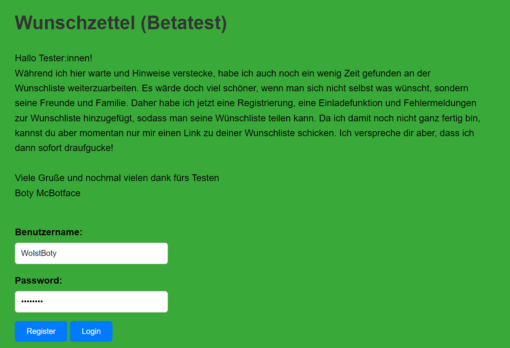


Nach der Anmeldung gelangt man auf eine Seite, auf der Wünsche eines Wunschzettels gepostet werden können. Hier habe ich testweise einen Wunsch gepostet und er wird auf der Seite angezeigt.

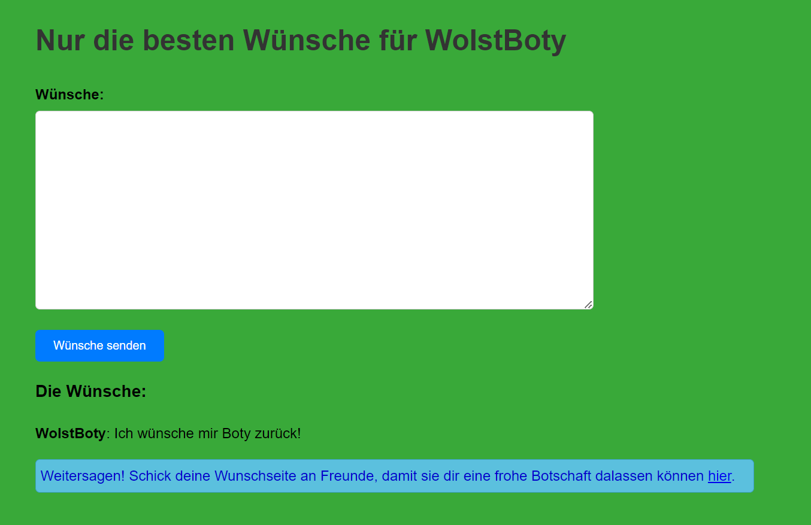

Des Weiteren gibt es eine Seite, auf der wir den Admin dazu einladen können, auf unseren Wunschzettel zu schauen:

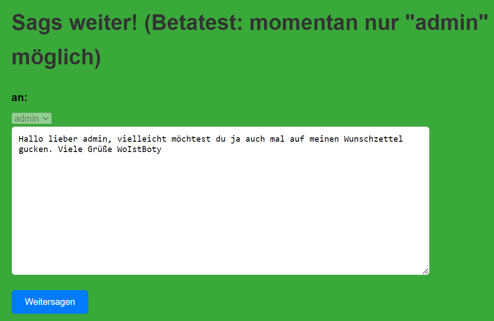

Nach dem Absenden der Einladung werden wir wieder auf unseren Wunschzettel geleitet und es erscheint die Nachricht "Einladung erfolgreich!". Hmm, ob wir das irgendwie zu unserem Vorteil nutzen können...?

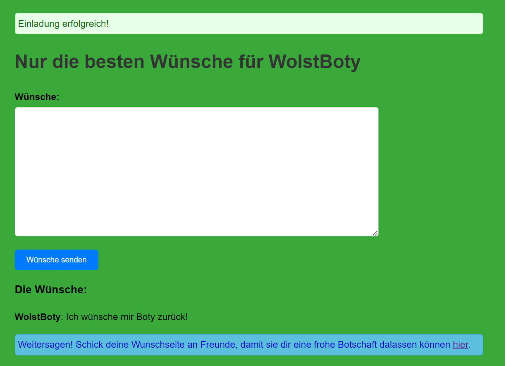

## Erster Teilschritt: JavaScript auf der eigenen Seite ausführen

Um das Verhalten der Seite überhaupt beeinflussen zu können, habe ich nach einer Schwachstelle gesucht, um Cross-Site-Scripting (XSS) durchzuführen und somit eigene JavaScript-Anweisungen ausführen zu können.

Dazu habe ich mir die Parameter auf der eigenen Wunschzettel-Seite genauer angeschaut.

Da der Parameter "message" bei erfolgreicher Einladung direkt in der URL angezeigt wurde, habe ich hier mit dem Testen begonnen. Viele Payloads haben leider nicht funktioniert, allerdings konnte ich mit dem folgenden Payload im message-Parameter immerhin meine eigenen Cookies anzeigen lassen:

```
message=<iframe onload=alert(document.cookie)></iframe>
```

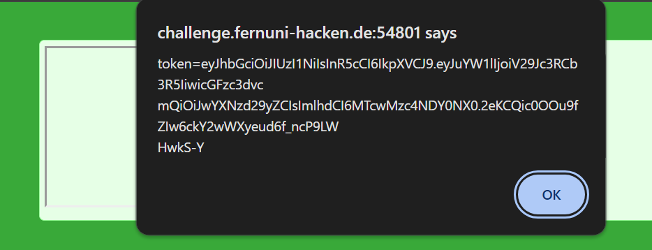

Also immerhin ein Teilerfolg! Da ich das Popup des Admins natürlich nicht sehen könnte, musste ich mir eine andere Methode überlegen, um die Cookies zu mir kommen zu lassen.

## Zweiter Teilschritt: Per XSS eigene Cookies auf eigener Seite posten

Da die Funktion, etwas auf der eigenen Seite zu posten, ja bereits eingebaut war, wollte ich diese nun nutzen, um hoffentlich die Cookies posten zu können.

Dazu habe ich mir das bereits eingebaute Formular "wishform" genauer angesehen:

```javascript
    <form id="wishform" method="post" action="/wish/WoIstBoty">
        <input id="username" name="username" type="hidden" value="WoIstBoty"/>
        <label for="wish">Wünsche:</label>
        <textarea id="wish" name="wish"></textarea><br>
        <button id="wish-btn" class="submit-btn" type="submit">Wünsche senden</button>
    </form>
```

Nach einiger Recherche ist mir aufgefallen, dass ich das Formular direkt per JavaScript ausfüllen und abschicken kann.

Zunächst habe ich eine eine Variable "x" erstellt, um einfacher auf das Formular zugreifen zu können. Da es sich um das erste Formular auf der Website handelt, ist der Index 0:
`x=document.forms[0];`

Die Variable "wish" ist der Wunsch, der auf unserem Wunschzettel gepostet wird. Also habe ich sie mit dem Wert des Cookies belegt:
`x.wish.value=document.cookie;`

Das Einzige, was nun noch fehlt, ist, das Formular auch tatsächlich abzusenden:
`x.submit()`

Der gesamte Payload im iframe sieht nun also so aus:

`?message=<iframe onload=x=document.forms[0];x.wish.value=document.cookie;x.submit()></iframe>`

Und siehe da: Meine Cookies sind auf meinem Wunschzettel <3

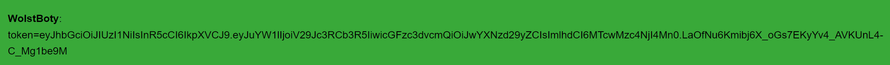

## Dritter Teilschritt: Payload an den Admin senden

Da ich meine eigene Cookies natürlich jederzeit in den Developer Tools nachschauen kann, bringen sie mich noch nicht zum Ziel.

Um also die Admin-Cookies zu bekommen, schaue ich mir die Seite noch einmal an, auf dem ich den Admin einladen kann, meine Seite zu besuchen.

Hier fällt auf, dass es ebenfalls ein Formular mit unterschiedlichen Variablen gibt.

```javascript
    <form method="post" action="/invite">
        <label for="an">an:</label>
        <select disabled id="an" name="an"><option>admin</option></select><br>
        <textarea name="message">Hallo lieber admin, vielleicht möchtest du ja auch mal auf meinen Wunschzettel gucken. Viele Grüße WoIstBoty</textarea><br>
        <input type="hidden" name="url" value="/list/WoIstBoty">
        <button id="submit" class="submit-btn" type="submit"> Weitersagen </button>
    </form>
```

Die URL-Variable, die auf der regulären Seite versteckt ist, klingt interessant. Mit `/list/WoIstBoty` zeigt sie genau auf unsere Wunschzettel-Seite.

Also habe ich ausprobiert, ob ich vielleicht den payload, der im letzten Schritt funktioniert hat, einfach hier einfügen kann. Dazu habe ich den Wert in den Developer Tools geändert und auf "Weitersagen" geklickt:

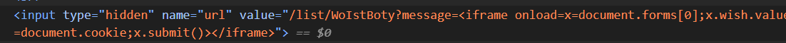

Nach kurzem Warten besucht der Admin tatsächlich die Seite und lässt die Cookies da - es hat funktioniert!

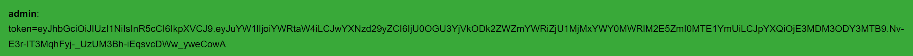

## Vierter Teilschritt: Admin-Cookies dekodieren

Da ich die Credentials im Cookie nicht direkt lesen kann, muss ich den Cookie zunächst dekodieren. Hierzu verwende ich das Rezept "JWT Decode" von https://gchq.github.io/CyberChef/ und erhalte das admin-Passwort.

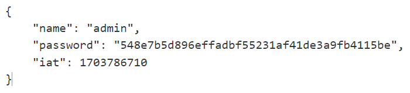

## Fünfter Teilschritt: Login als admin und flag

Diese Credentials verwende ich nun, um mich als admin einzuloggen. Und tatsächlich: Die flag wurde als Wunsch auf dem Wunschzettel gepostet:

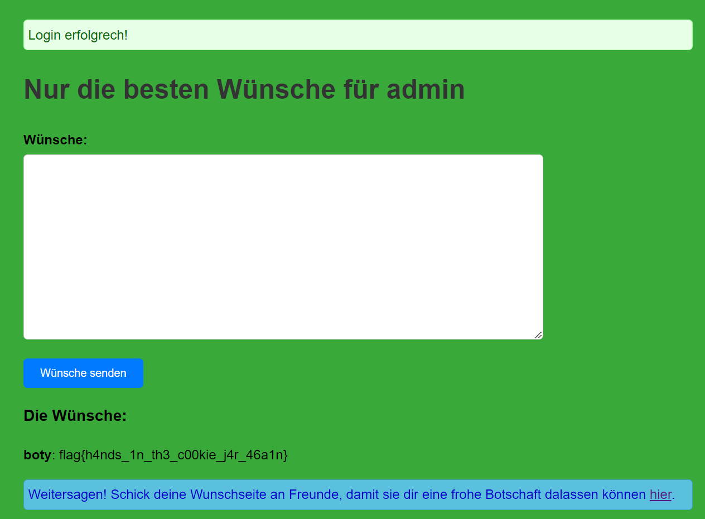

Die flag lautet also `flag{h4nds_1n_th3_c00kie_j4r_461n}`.